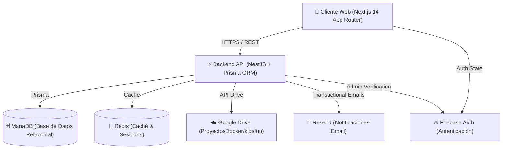

# 🗺️ Guía de Arquitectura y Mantenimiento - Kidsfun System

Documento de referencia rápida sobre la estructura, funcionamiento y flujo de mantenimiento del sistema **Kidsfun** (alquiler de inflables, gestión de eventos, clientes y contratos).

---

## 📐 1. Visión General de la Arquitectura

El proyecto está estructurado como un **Monorepo pnpm** moderno, desacoplado y optimizado para alto rendimiento y producción en contenedores Docker.



---

## 📁 2. Estructura del Monorepo

```
smap_project_system/
├── apps/
│   ├── api/                      # Backend NestJS (Puerto 3001)
│   │   ├── credentials/          # Credenciales del Service Account de Google/Firebase
│   │   ├── prisma/
│   │   │   ├── schema.prisma     # Modelos de BD (Products, Clients, Contracts, Events)
│   │   │   └── migrations/       # Migraciones SQL registradas
│   │   ├── src/
│   │   │   ├── auth/             # Guard global, Firebase Admin y Allowlist de Admins
│   │   │   ├── upload/           # UploadService + GoogleDriveService (Carga a Drive)
│   │   │   ├── products/         # Módulo y endpoints de productos
│   │   │   ├── waivers/          # Firma de contratos, waivers e integracion Resend
│   │   │   ├── events/           # Gestión de eventos y calendario
│   │   │   └── main.ts           # Entrypoint Express + NestJS (CORS, 50MB body limit)
│   │   └── Dockerfile            # Construcción de imagen api (Node 20 Alpine)
│   │
│   └── web/                      # Frontend Next.js 14 (Puerto 3000 -> 8080)
│       ├── public/               # Assets estáticos y fallback local /media
│       ├── src/
│       │   ├── app/              # Rutas Next.js App Router (Públicas y /admin)
│       │   ├── components/       # Componentes de UI, Tablas, Forms y AdminGuard
│       │   └── lib/
│       │       ├── api.ts        # Cliente Fetch tipado para la API
│       │       ├── firebase.ts   # Configuración Firebase Client
│       │       └── image-compress.ts # Compresor inteligente para fotos de celulares (Samsung S26, HEIC, JPG)
│       └── Dockerfile            # Construcción de imagen web (Node 20 Alpine)
│
├── docker-compose.yml            # Configuración principal de contenedores en producción
├── build_deploy_portainer.sh     # Script automatizado de compilación y push a Docker Hub
└── PROJECT_GUIDE.md              # Este documento
```

---

## ⚙️ 3. Funcionamiento de Cada Apartado

### 🔑 A. Autenticación y Control de Acceso (`apps/api/src/auth`)
* **Firebase Admin SDK:** Valida los tokens Bearer enviados por la Web en las cabeceras HTTP.
* **Allowlist de Administradores (`admin-allowlist.ts`):** Define los correos con acceso al panel (`/admin`). Se configura vía la variable de entorno `ADMIN_EMAILS`.
* **Soporte Base64 de Credenciales (`FIREBASE_CREDENTIALS_BASE64`):** Permite inyectar la llave del Service Account desde las variables de entorno de Portainer sin subir claves privadas a GitHub.

### 🖼️ B. Carga de Imágenes y Google Drive (`apps/api/src/upload`)
* **Compresión en el Cliente (`image-compress.ts`):** Antes de subir una foto (ej: 30MB desde un Samsung Galaxy S26 o iPhone), el navegador la redimensiona automáticamente a un máximo de **2048x2048px** (~500KB) preservando calidad nítida.
* **Google Drive Sync (`google-drive.service.ts`):** 
  * Detecta o crea automáticamente la subcarpeta **`kidsfun`** dentro de la carpeta **`ProyectosDocker`** (`1_5uQEdZB83g8rPnVglKjK0L9RN3Gk8Qo`).
  * Aplica permisos de lectura pública para que la imagen se muestre de inmediato en el sitio público y en el panel.
* **Almacenamiento Local Híbrido:** Si Google Drive no responde o cae, guarda una copia de seguridad en la carpeta montada `media/product_images/`.

### 📦 C. Gestión de Productos (`apps/web/src/app/admin/productos`)
* **Vista Predeterminada:** La vista por defecto es la **Tabla de Productos**, permitiendo búsqueda rápida, estado (Publicado/Borrador) y filtro.
* **Vista Kanban Alternativa:** Permite agrupar los juegos inflables por categoría visualmente.
* **Edición y Carga Múltiple (`ProductForm.tsx`):**
  * Subida de hasta 6 imágenes por producto.
  * Botón ⭐ para cambiar la foto principal.
  * Botón 🗑️ para remover imágenes individuales de la galería.

### 📜 D. Contratos, Waivers y Correos (`apps/api/src/waivers`)
* **Generación de Contratos:** Generación en PDF de contratos de arrendamiento y waivers digitales.
* **Envío de Emails via Resend (`EmailService`):** Envía comprobantes y enlaces de restauración de contraseña con plantilla HTML corporativa de Kidsfun.

---

## 🛠️ 4. Guía de Mantenimiento y Comandos Frecuentes

### 💻 Desarrollo Local
Para ejecutar la API y el Frontend localmente en tu computadora:

```bash
# Instalar dependencias del monorepo
pnpm install

# Iniciar la API en modo dev (Puerto 3001)
pnpm --filter api dev

# Iniciar la Web en modo dev (Puerto 3000)
pnpm --filter web dev
```

### 🗄️ Base de Datos y Migraciones Prisma
Si realizas un cambio en `apps/api/prisma/schema.prisma`:

```bash
# Crear y aplicar una nueva migración en desarrollo
npx prisma migrate dev --name tu_cambio_aqui

# Aplicar migraciones pendientes en producción
npx prisma migrate deploy
```

---

## 🚀 5. Proceso de Despliegue en Portainer

El despliegue está automatizado para construir las imágenes con **4GB de RAM** en tu Mac y subirlas a Docker Hub:

### Paso 1: Compilar y subir a Docker Hub
Ejecuta en la terminal de tu proyecto:
```bash
./build_deploy_portainer.sh
```

### Paso 2: Actualizar en Portainer
1. Abre tu panel de Portainer -> **`Stacks`** -> **`newkidsfun`**.
2. Ve a la pestaña **`Editor`**.
3. Marca la casilla **`Re-pull image and update`** (debajo del editor).
4. Haz clic en **`Update the stack`**.

---

## 🔐 6. Variables de Entorno Clave (`docker-compose.yml`)

| Variable | Descripción |
| :--- | :--- |
| `DATABASE_URL` | String de conexión a MariaDB (`mysql://mrgomez:Karin2100@db:3306/smap_kf`) |
| `ADMIN_EMAILS` | Lista de correos autorizados para entrar a `/admin` |
| `FIREBASE_CREDENTIALS_BASE64` | Credencial JSON del Service Account codificada en Base64 |
| `GOOGLE_DRIVE_FOLDER_ID` | ID de la carpeta contenedora en Google Drive (`ProyectosDocker`) |
| `RESEND_API_KEY` | Clave API de Resend para envío de correos transaccionales |

---

*Guía creada para mantenimiento del proyecto Kidsfun.*
